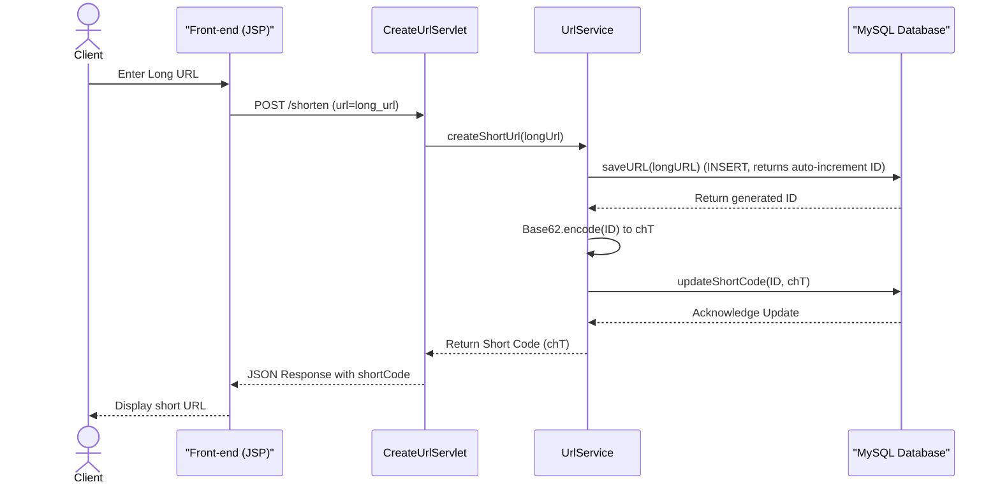
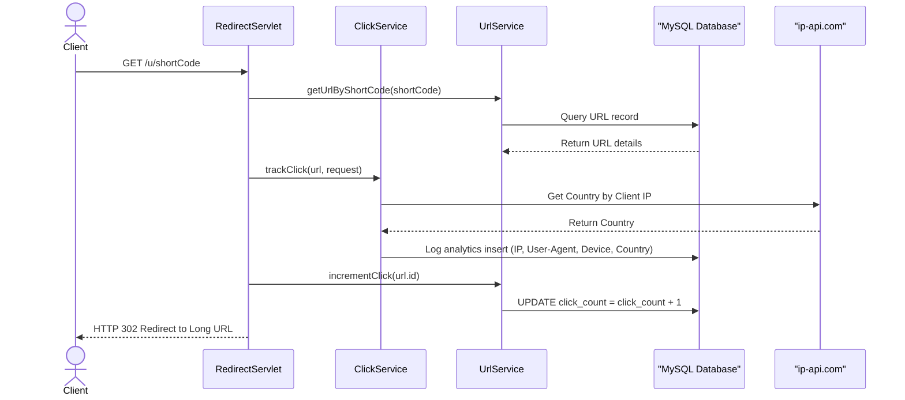
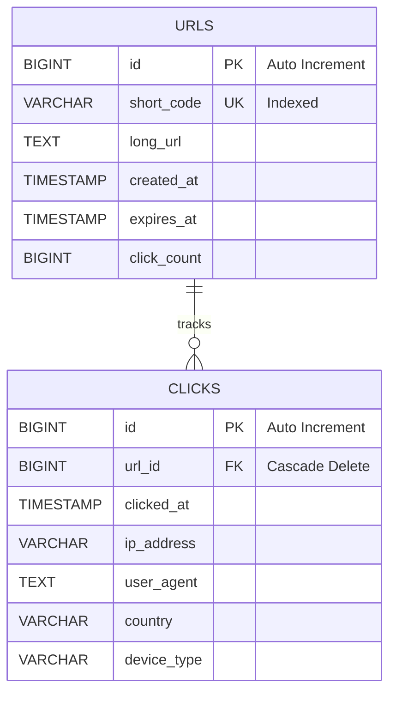

# URL Shortener with Analytics

A high-performance, low-level design (LLD) implementation of a distributed URL shortener service. Built using native Java Servlets, vanilla JDBC, and MySQL, this project is optimized for speed, reliability, and low resource overhead. It uses a **Base62 encoding algorithm** mapped to database-sequence primary keys to generate collision-free, short URLs, while gathering comprehensive click analytics (country, device, IP, and timestamp) in real-time.

---

## Key Features

- **Collision-Free Encoding**: Utilizes a MySQL auto-increment primary key combined with **Base62 encoding** to guarantee unique short codes without the collision risk of MD5/SHA hashes.
- **Real-Time Click Tracking**: Collects granular telemetry on redirects, including IP address, user-agent parsing for device classification (Desktop vs. Mobile), and timestamping.
- **Geo-IP Location Resolution**: Uses external API integration (`ip-api.com`) to dynamically resolve client IP addresses to countries during redirect requests.
- **Paginated Analytics Dashboard**: Features a clean web UI (`index.jsp`) with pagination to search and view click records, helping prevent database memory exhaustion under high traffic.
- **Dockerized Multi-Stage Environment**: Complete setup package utilizing **Docker Compose** to manage isolated Tomcat 9 and MySQL 8 containers.

---

## System Architecture

### Request Flows

#### 1. Shorten URL Flow


#### 2. Redirect & Analytics Flow


---

## Database Schema

The relational schema is structured to optimize write performance and enforce data integrity using cascading constraints.



---

## Core Algorithm: Base62 Conversion

The core shortening algorithm maps the database's sequential `BIGINT` ID into a Base62 string using the character set `[a-zA-Z0-9]`. This ensures the short URLs are as compact as possible. For example, a 6-character short code can represent up to $62^6 \approx 56.8 \text{ billion}$ unique URLs.

```java
public class Base62 {
    private final static String chars = "abcdefghijklmnopqrstuvwxyzABCDEFGHIJKLMNOPQRSTUVWXYZ0123456789";

    public static String encode(long num) {
        if (num == 0) return "a";
        StringBuilder sb = new StringBuilder();
        while (num > 0) {
            int rem = (int) (num % 62);
            sb.append(chars.charAt(rem));
            num /= 62;
        }
        return sb.reverse().toString();
    }
}
```

---

## API Documentation

### 1. Shorten a URL
* **Endpoint**: `POST /shorten`
* **Content-Type**: `application/x-www-form-urlencoded`
* **Parameters**:
  - `url` (String, required): The target long URL to shorten.
* **Success Response (200 OK)**:
  ```json
  { "url": "chT" }
  ```
* **Error Response (400 Bad Request)**:
  ```json
  { "error": "Invalid URL" }
  ```

### 2. URL Redirection
* **Endpoint**: `GET /u/{short_code}`
* **Description**: Performs a standard HTTP 302 redirect to the destination long URL, tracking click telemetry asynchronously.
* **Error Response (404 Not Found)**:
  ```json
  { "error": "Short URL not found" }
  ```

### 3. Fetch Click Analytics
* **Endpoint**: `GET /analytics/{short_code}`
* **Query Parameters**:
  - `page` (int, optional): Page number for pagination. Defaults to `1` (20 items per page).
* **Success Response (200 OK)**:
  ```json
  {
    "data": [
      {
        "ip": "127.0.0.1",
        "country": "India",
        "device": "desktop",
        "time": "2026-07-20 20:08:11.0",
        "userAgent": "Mozilla/5.0..."
      }
    ]
  }
  ```

---

## Tech Stack & Implementation Details

- **Backend**: Java 17, Java Servlet API 4.0.1
- **Database**: MySQL 8.0 with transactional JDBC queries
- **Web App Container**: Apache Tomcat 9.0
- **Containerization**: Docker, Docker Compose
- **Front-End**: HTML5, Vanilla JavaScript, CSS3, JSP

---

## How to Run Locally

### Prerequisites
- Docker & Docker Compose installed.
- Maven 3.9+ (optional, as compilation is containerized during build stage).

### Run with Docker Compose
1. **Clone the repository** and navigate to the project directory:
   ```bash
    git clone https://github.com/<your-username>/url-shortener-with-analytics.git
    cd url-shortener-with-analytics
    ```

2. **Boot up the containerized stack**:
   ```bash
   docker-compose up --build
   ```
   *This command compiles the source code via a multi-stage Maven container, runs static packaging into a `.war` file, and deploys it to the Apache Tomcat servlet container. Concurrently, it boots up a MySQL container and executes the database setup from `db/init.sql`.*

3. **Access the application**:
   - Web Portal: [http://localhost:8080/](http://localhost:8080/)
   - Redirect Endpoint: `http://localhost:8080/u/{shortCode}`
   - MySQL Instance: Port `3307` (Root user password: `root`)

---

## Low-Level Design (LLD) Best Practices Implemented

1. **Separation of Concerns (SoC)**: Structured with clear layer responsibilities: `Controller` (Servlets), `Service` (Business Rules), `Repository` (JDBC operations), and `Model` (Data representations).
2. **Resource Management**: Utilizes Java's **try-with-resources** syntax for handling JDBC connection scopes, ensuring statements and result sets are released promptly without memory leaks.
3. **Optimized Pagination**: Click analytics queries enforce a database-level `LIMIT` and `OFFSET` to prevent loading millions of historical clicks into JVM memory.
4. **Input Sanitization & Validation**: Sanitizes JSON payloads and verifies URL structures using Java URI parser schemas before database operations.
